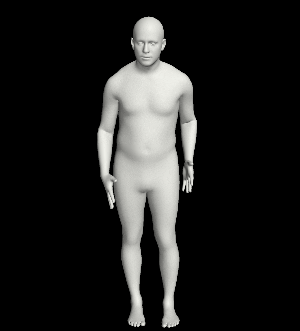
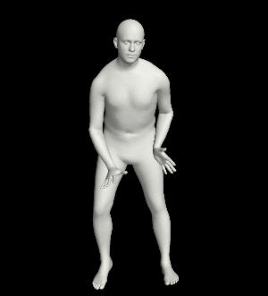
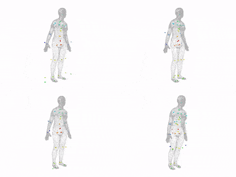

# VPoser: Variational Human Pose Prior for Body Inverse Kinematics


## Description
The articulated 3D pose of the human body is high-dimensional and complex. 
Many applications make use of a prior distribution over valid human poses, but modeling this distribution is difficult.
Here we present VPoser, a learning based variational human pose prior trained from a large dataset of human poses represented as SMPL bodies.
This body prior can be used as an Inverse Kinematics (IK) solver for many tasks such as fitting a body model to images 
as the main contribution of this repository for [SMPLify-X](https://smpl-x.is.tue.mpg.de/). 
VPoser has the following features: 
 - defines a prior of SMPL pose parameters
 - is end-to-end differentiable
 - provides a way to penalize impossible poses while admitting valid ones
 - effectively models correlations among the joints of the body
 - introduces an efficient, low-dimensional, representation for human pose
 - can be used to generate valid 3D human poses for data-dependent tasks

## Table of Contents
  * [Description](#description)
  * [Installation](#installation)
  * [Tutorials](#tutorials)
  * [Advanced IK Capabilities](#advanced-ik-capabilities)
  * [Train VPoser](#train-vposer)
  * [Citation](#citation)
  * [License](#license)
  * [Acknowledgments](#acknowledgments)
  * [Contact](#contact)
  * [FAQ](https://github.com/nghorbani/human_body_prior/wiki/FAQ)

## Installation (uv)
Requirements
- Python 3.11–3.12 (recommended). Avoid 3.13/3.14 for now due to limited third‑party wheels.
- uv (https://docs.astral.sh/uv/) installed

Core (recommended)
```bash
uv sync
```

Development tools (tests, linters)
```bash
uv sync --extra dev
```

Optional features
- Lightning: `uv sync --extra pl`
- Visualization: `uv sync --extra vis`

Quick check
```bash
uv run python -c "import human_body_prior; print('ok')"
```

Run tests (pytest)
```bash
uv sync --extra dev
uv run pytest -q
```

Notes
- PyTorch CUDA builds: install the appropriate wheel per your CUDA setup (default dependency is CPU). See https://pytorch.org/get-started for selection guidance.
- If your global Python is 3.13/3.14, create the env with a supported version, e.g.:
  - `uv venv --python 3.12 && uv sync`
  - or `uv python pin 3.12` before `uv sync`

## Model Weights
- VPoser weights: Download the pretrained VPoser checkpoint(s) from the SMPL-X project page. The tutorials include guidance on expected folder layout and how to point the code to the checkpoint.
- SMPL-X body models: Download SMPL-X model files (e.g., `model.npz`) from the SMPL-X website (registration required). You will need to provide the path via `bm_fname` when constructing `BodyModel`.

Where to find details
- See tutorials/vposer.ipynb for concrete instructions, example paths, and usage. It shows how to load VPoser weights and SMPL-X models for sampling and IK examples.


## Tutorials



* [VPoser Body poZ Space for SMPL Body Model Family](tutorials/vposer.ipynb)
* [Sampling Novel Body Poses with VPoser](tutorials/vposer_sampling.ipynb)

## Advanced IK Capabilities


Given position of some key points one can find the necessary body joints' rotation configurations via inverse kinematics (IK). 
The keypoints could either be 3D (joint locations, 3D mocap markers on body surface) or 2D (as in [SMPLify-X](https://smpl-x.is.tue.mpg.de/)).
We provide a comprehensive IK engine with flexible key point definition interface demonstrated in tutorials: 
- [IK for 3D joints](tutorials/ik_example_joints.py) 
- [IK for mocap markers](tutorials/ik_example_mocap.py) 

One can define keypoints on the SMPL body, e.g. joints, or any locations relative to the body surface 
and fit body model parameters to them while utilizing the efficient learned pose parameterization of 
[VPoser](https://github.com/nghorbani/human_body_prior). The supported features are:
- Batch enabled
- Flexible key point definition
- LBFGS with wolfe line-search and ADAM optimizer already enabled
- No need for initializing the body (always starts from zero)
- Optimizes body pose, translation and body global orientation jointly and iteratively


## Train VPoser
We train VPoser, as a [variational autoencoder](https://arxiv.org/abs/1312.6114)
that learns a latent representation of human pose and regularizes the distribution of the latent code 
to be a normal distribution.
We train our prior on data from the [AMASS](https://amass.is.tue.mpg.de/) dataset, 
that holds the SMPL pose parameters of various publicly available human motion capture datasets.


## Citation
Please cite the following paper if you use this code directly or indirectly in your research/projects:
```
@inproceedings{SMPL-X:2019,
  title = {Expressive Body Capture: 3D Hands, Face, and Body from a Single Image},
  author = {Pavlakos, Georgios and Choutas, Vasileios and Ghorbani, Nima and Bolkart, Timo and Osman, Ahmed A. A. and Tzionas, Dimitrios and Black, Michael J.},
  booktitle = {Proceedings IEEE Conf. on Computer Vision and Pattern Recognition (CVPR)},
  year = {2019}
}
```
Also note that if you consider training your own VPoser for your research using the AMASS dataset, 
then please follow its respective citation guideline.
 

## Contact
The code in this repository is developed by [Nima Ghorbani](https://nghorbani.github.io/) 
while at [Perceiving Systems](https://ps.is.mpg.de/), Max-Planck Institute for Intelligent Systems, Tübingen, Germany.

If you have any questions you can contact us at [smplx@tuebingen.mpg.de](mailto:smplx@tuebingen.mpg.de).

For commercial licensing, contact [ps-licensing@tue.mpg.de](mailto:ps-licensing@tue.mpg.de)

## License

Software Copyright License for **non-commercial scientific research purposes**.
Please read carefully the [terms and conditions](./LICENSE) and any accompanying documentation before you download and/or use the SMPL-X/SMPLify-X model, data and software, (the "Model & Software"), including 3D meshes, blend weights, blend shapes, textures, software, scripts, and animations. By downloading and/or using the Model & Software (including downloading, cloning, installing, and any other use of this github repository), you acknowledge that you have read these terms and conditions, understand them, and agree to be bound by them. If you do not agree with these terms and conditions, you must not download and/or use the Model & Software. Any infringement of the terms of this agreement will automatically terminate your rights under this [License](./LICENSE).
